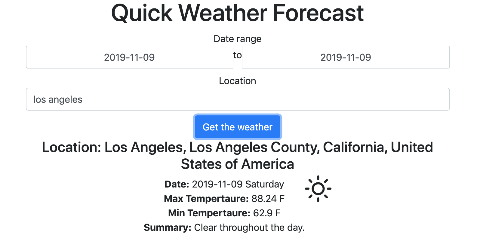

# quick weather forecast
quick weather web application using python and flask

Here's a quick preview of what it looks like:

To use, run 'python app.py' and navigate to 'http://0.0.0.0:5000/' in your browser.
